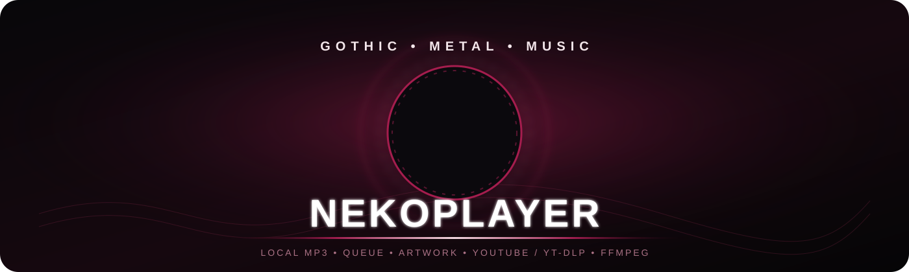

  

  
  
  </a>
  

  <b>A Gothic / Metal inspired desktop music player for Windows.</b> 
  Local playback • Library • Artwork • Queue • YouTube / yt-dlp • FFmpeg

  <a href="../../releases/tag/v1.0.0">🚀 Download v1.0.0</a> •
  <a href="#installation">📦 Installation</a> •
  <a href="#features">✨ Features</a>

---

## ✨ Features

| | Capability | | Capability |
|---|---|---|---|
| 🎵 | Local MP3 playback | 📚 | Music library management |
| 🖼️ | Album artwork & covers | 📋 | Queue / playlist support |
| ▶️ | YouTube integration via yt-dlp | 🔄 | FFmpeg-powered MP3 conversion |
| ⚙️ | Embedded Python backend | 🖥️ | Native Windows desktop app |
| 🖤 | Gothic / Metal visual design | 📦 | Portable ZIP distribution |
| 🛠️ | Windows installer | | |

## 📸 Interface Preview

  

Main player interface

  

Queue / playlist interface

## 💿 Installation

### Recommended — Windows Installer

1. Open the [v1.0.0 Release](../../releases/tag/v1.0.0).
2. Download **NekoPlayer-Setup.exe**.
3. Run the installer and follow the setup wizard.
4. Choose whether to create a desktop shortcut.
5. Launch **NekoPlayer**.

> No Python installation is required for the packaged release.

### Portable Edition

1. Open the [v1.0.0 Release](../../releases/tag/v1.0.0).
2. Download **NekoPlayer-Release.zip**.
3. Extract the archive to any folder.
4. Launch `NekoPlayer.exe`.

> The portable edition does not require an installer.

## 🖥️ System Requirements

| Requirement | Details |
|---|---|
| Operating system | Windows 10 / Windows 11 |
| Architecture | 64-bit (x64) |
| Internet | Only required for online features such as YouTube / yt-dlp |
| Python | Not required for packaged releases |

## 🚀 Usage

Launch NekoPlayer and manage your music directly from the desktop interface. Use the library for local tracks, build a queue, browse artwork, and use supported online media features when connected to the internet.

## 📦 v1.0.0 — First Stable Release

The first public stable release of NekoPlayer.

### Included downloads

- **NekoPlayer-Setup.exe** — Windows installer
- **NekoPlayer-Release.zip** — Portable version

## ⚠️ Windows SmartScreen

The release binaries may not be code-signed. Windows SmartScreen can therefore display a warning when the installer or application is launched.

If you downloaded NekoPlayer from the official GitHub release page, verify the filename and source before proceeding.

## 🐛 Troubleshooting

**NekoPlayer does not start**

- Confirm that Windows is 64-bit and supported.
- For the portable edition, re-extract the complete ZIP archive.
- For the installer edition, reinstall from the latest release.
- For YouTube / yt-dlp features, verify that your internet connection is working.

## 📄 License

No open-source license has been declared yet. All rights are reserved unless otherwise stated by the project owner.

## 👤 Author

**senshimhamed-ux**

  

Made with 🖤 for music lovers.

