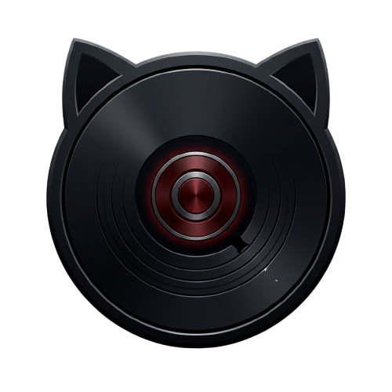
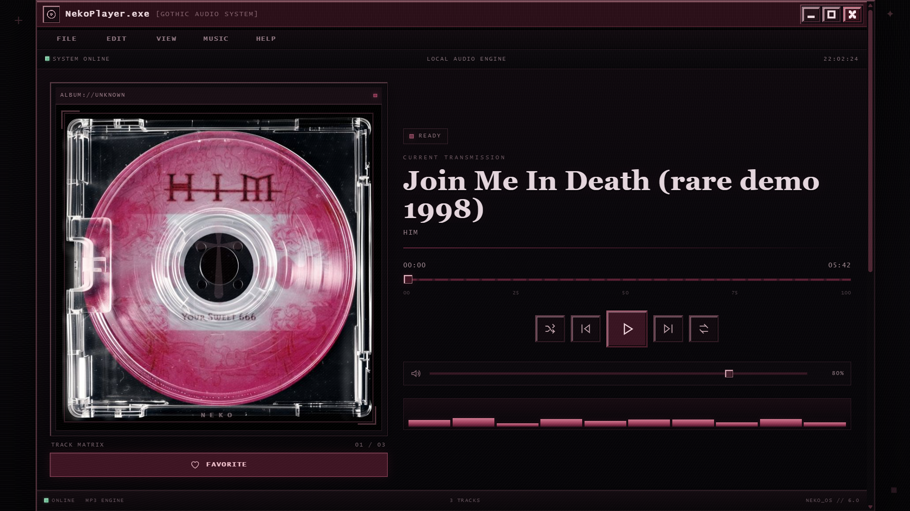
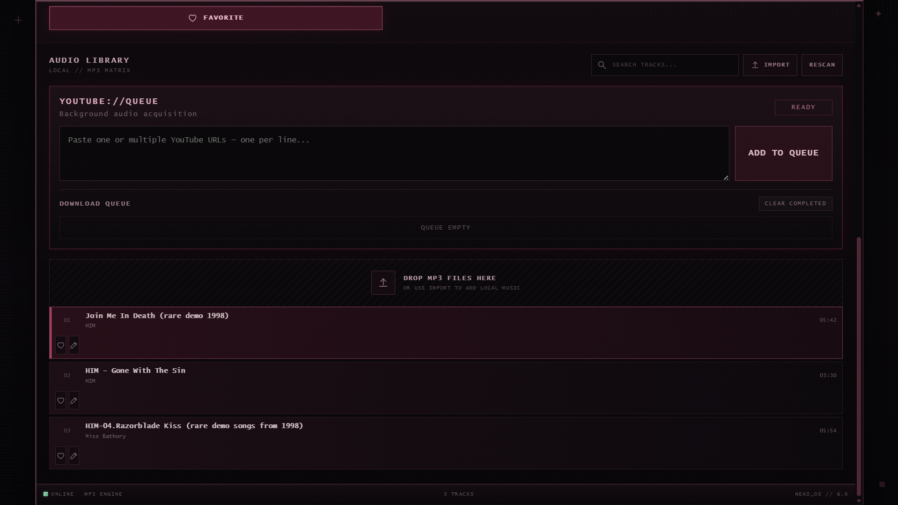

# 🐈 NekoPlayer

> A Gothic / Metal inspired desktop music player for Windows.

NekoPlayer is a lightweight Windows desktop music player built around an original HTML/CSS/JavaScript interface with a Python backend. It is designed for local music playback while also providing a queue, artwork support, YouTube/yt-dlp integration, and FFmpeg-based conversion.

## ✨ Features

- 🎵 Local MP3 playback
- 📚 Music library management
- 🖼️ Album artwork and covers
- 📋 Queue / playlist support
- ▶️ YouTube integration through yt-dlp
- 🔄 FFmpeg-powered MP3 conversion
- ⚙️ Embedded Python backend
- 🖥️ Native Windows desktop application
- 🖤 Gothic / Metal visual design
- 📦 Portable ZIP distribution
- 🛠️ Windows installer

## 📸 Preview

  

  

  

## 💿 Installation

### Recommended — Windows Installer

1. Download **NekoPlayer-Setup.exe** from the [v1.0.0 Releases](../../releases/tag/v1.0.0) page.
2. Run the installer.
3. Follow the installation wizard.
4. Optionally create a desktop shortcut.
5. Launch **NekoPlayer**.

No Python installation is required for the packaged release.

### Portable Version

1. Download **NekoPlayer-Release.zip** from the [v1.0.0 release](../../releases/tag/v1.0.0).
2. Extract the ZIP to any folder.
3. Run `NekoPlayer.exe`.

The portable version does not require an installer.

## 🖥️ System Requirements

- Windows 10 or Windows 11
- 64-bit Windows
- Internet connection only for online features such as YouTube/yt-dlp

## 🚀 Usage

Launch NekoPlayer and use the main interface to manage your music library, play local tracks, control the queue, and access supported online media features.

## 📦 Release

### v1.0.0 — First Stable Release

The first public stable release of NekoPlayer.

**Included downloads:**

- `NekoPlayer-Setup.exe` — Windows installer
- `NekoPlayer-Release.zip` — Portable version

## ⚠️ Windows SmartScreen

Because the release binaries may not be code-signed, Windows SmartScreen can display a warning when launching the installer or application. If you downloaded NekoPlayer from the official GitHub release page, verify the filename before continuing.

## 🐛 Troubleshooting

If NekoPlayer does not start:

1. Make sure you are using 64-bit Windows 10/11.
2. Re-extract the complete portable ZIP if using the portable version.
3. If using the installer, reinstall NekoPlayer from the latest release.
4. For online features, verify that your internet connection is working.

## 📄 License

No open-source license has been declared yet. All rights are reserved unless otherwise stated by the project owner.

## 👤 Author

**senshimhamed-ux**

---

Made with 🖤 for music lovers.
